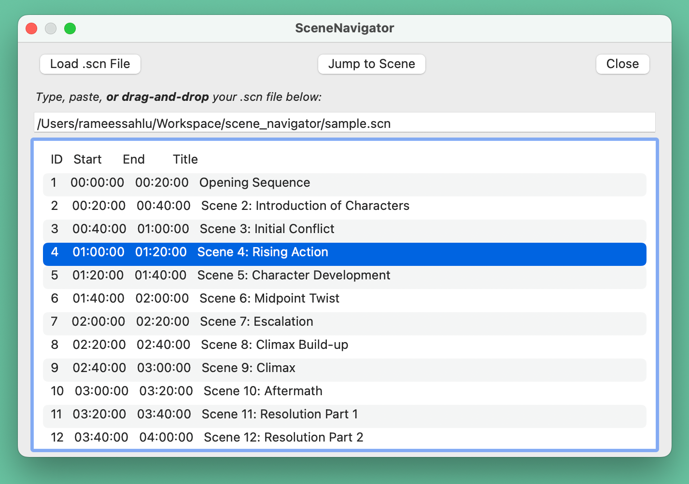

# 🎬 SceneNavigator - VLC Scene Jump Plugin

**SceneNavigator** is a lightweight VLC plugin that lets you **navigate through labeled scenes in a video**, just like jumping through subtitle chapters. It uses a simple `.scn` file format to define named segments (e.g., Introduction, Flashback, Ending), which can be selected from a side panel to jump directly to that part of the video.

## 🌟 Why SceneNavigator?

- **Breaks down lengthy videos:** Easily create a “table of contents” for any video, making it quick to jump to specific scenes, presentations, lectures, or film segments.
- **Efficient navigation:** Instantly move between chapters or major sections without endless seeking.
- **Ideal for learning and collaboration:** Mark key moments, review important segments, and share scene files with others for meetings, education, or creative review.
- **Improves accessibility:** Helps users with disabilities or attention needs quickly reach relevant parts.

## ✨ Features

- 📖 Loads `.scn` scene catalog files (similar to `.srt`)
- ⏩ Jump to scenes by clicking on titles
- 🧠 Auto-loads `.scn` file matching the video name
- 🖥 Integrated with VLC via Extensions UI

## 📁 Scene File Format (`.scn`)

```plaintext
1
00:00:00,000 --> 00:02:30,000
Introduction

2
00:02:30,000 --> 00:05:00,000
Main Scene 1

3
00:05:00,000 --> 00:08:00,000
Flashback

4
00:08:00,000 --> 00:10:00,000
Ending
```

Each scene block:
- Begins with an index
- Contains a start/end timestamp
- Has a scene title



## 🧪 Installation Instructions

### 🔧 Option 1: Manual Installation (Recommended for Developers)

#### 🪟 Windows
1. Press `Windows + R`, type:
   ```shell
   %APPDATA%\vlc\lua\extensions\
   ```
2. Create the folder if it doesn’t exist.
3. Copy `scene_navigator.lua` to this folder.
4. Restart VLC.

#### 🍎 macOS
   ```bash
   mkdir -p ~/Library/Application\ Support/org.videolan.vlc/lua/extensions/
   cp scene_navigator.lua ~/Library/Application\ Support/org.videolan.vlc/lua/extensions/
   ```

#### 🐧 Linux
   ```bash
   mkdir -p ~/.local/share/vlc/lua/extensions/
   cp scene_navigator.lua ~/.local/share/vlc/lua/extensions/
   ```

### 🔧 Option 2: Install via .vlcext Package (Easier for Users)
1. Download the file: `SceneNavigator.vlcext`
2. Change the file extension from `.vlcext` to `.zip` (if needed), then extract it.
3. Inside the extracted folder, you will find `scene_navigator.lua`.
4. Copy it to your VLC extensions folder:

   | Platform | Extensions Folder |
   |----------|-------------------|
   | Windows  | `%APPDATA%\vlc\lua\extensions\` |
   | macOS    | `~/Library/Application Support/org.videolan.vlc/lua/extensions/` |
   | Linux    | `~/.local/share/vlc/lua/extensions/` |

5. Restart VLC.

## ✅ Step 3: Use the Plugin
1. Open VLC and start any video.
2. Go to the top menu: `View → SceneNavigator`.
3. If a `.scn` file with the same name exists next to your video file, it will auto-load.
4. Or use the “Load .scn File” button to manually select one.

## 🧳 Packaging the Plugin as .vlcext
To create your own shareable `.vlcext`:
```bash
zip SceneNavigator.vlcext scene_navigator.lua
```
You can then rename it back to `.zip` to extract, or share directly.

## ⚠️ Platform Notes

- **Windows & Linux:** All features work as intended.
- **macOS:**  
  - Only the first scene in the scene list is reliably selectable via mouse or keyboard. Highlighting other rows won’t trigger real selection due to limitations/bugs in VLC’s Qt interface and Lua dialog API on macOS. There’s no reliable Lua-only fix for this issue.
- **Drag & Drop:** Drag & drop of `.scn` files is supported on **Linux** and **macOS** only. Not supported on **Windows**.

## 🛠 Development Ideas

Want to contribute or extend it?
- Hotkeys for next/previous scene
- Export `.scn` based on current play position
- Highlight current scene while playing
- Multiple `.scn` tracks (like subtitles)

## 👤 Author

Developed by Ramees Sahlu. Built with VLC Lua scripting.

## 📜 License

MIT License — free to use, modify, and distribute.